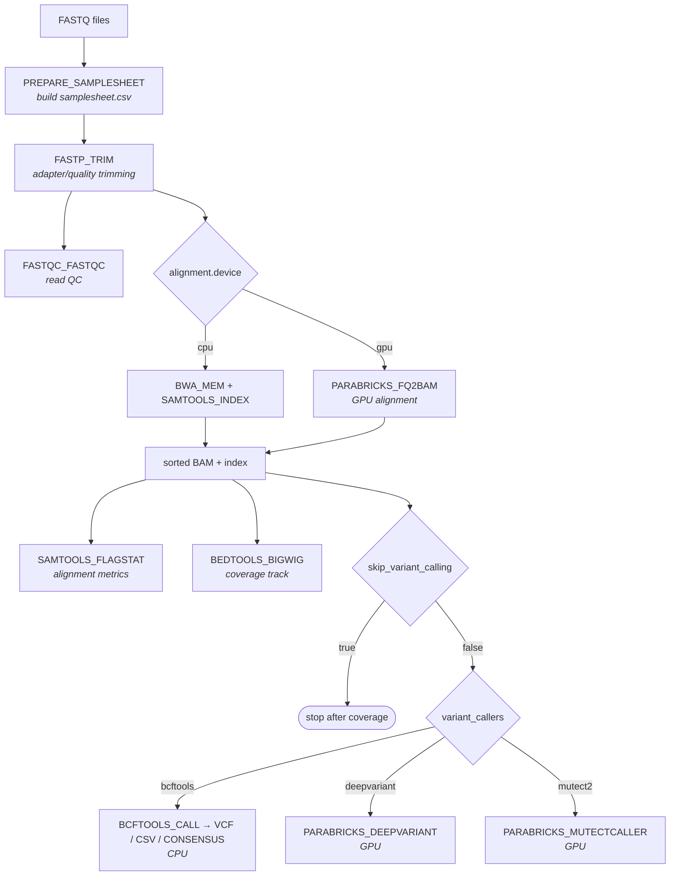
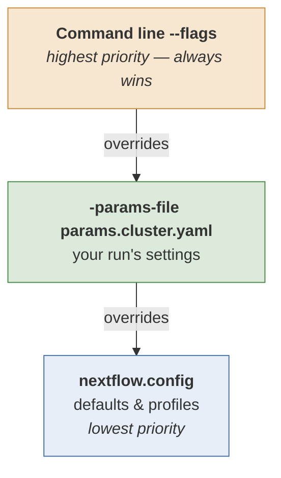

# nf-dnaseq

A Nextflow pipeline for DNA-seq analysis of paired-end short reads: read trimming, QC, alignment, coverage tracks, and variant calling. It runs on a SLURM cluster with Apptainer containers, and supports both **CPU** (bwa + samtools + bcftools) and **GPU** (NVIDIA Parabricks) execution paths.

This guide is written for researchers who want to run the pipeline on their own data on the cluster.

---

## What the pipeline does



**Execution paths at a glance:**

| Stage | CPU option | GPU option |
|---|---|---|
| Alignment | `bwa mem` + `samtools` | Parabricks `fq2bam` |
| Germline calling | `bcftools` | Parabricks `deepvariant` |
| Somatic calling | — | Parabricks `mutectcaller` (`mutect2`) |

> **Note:** `deepvariant` and `mutect2` are **GPU-only** (Parabricks), regardless of `alignment.device`. If you request either of those callers, the run needs GPU nodes even if you aligned on CPU. `bcftools` is CPU-only.

---


## Requirements

- **Nextflow 26.04.4 or newer** (declared in `manifest.nextflowVersion`; the run
  aborts on anything older). To use a specific version without installing it
  system-wide: `NXF_VER=26.04.6 nextflow run ...`
- A container engine: Docker (`-profile docker`) or Apptainer (`-profile cluster`).

If you clone the repo rather than letting Nextflow fetch it, the modules are git
submodules, so clone recursively — a plain clone leaves `modules/` empty and every
`include` fails:

```bash
git clone --recursive https://github.com/EIT-GBI/nf-dnaseq.git
# already cloned?
git submodule update --init --recursive
```

> **Pulling later?** `git pull` moves this repo's *pointer* to each module but
> does not move the module itself, so you can end up running old module code
> against a new pipeline — with no error to tell you. Always follow a pull with:
>
> ```bash
> git submodule update --init --recursive
> ```

### Quick check that everything works

A small end-to-end run on a public test dataset (a ~30 KB SARS-CoV-2 genome and
two tiny FASTQ pairs, fetched over HTTPS - nothing to download by hand):

```bash
nextflow run . -profile test,docker
```

---

## TLDR: Run it on the cluster

You do **not** need to clone the repo to run the pipeline. Nextflow can pull it straight from GitHub, so a run is four steps: make a working directory, fetch the params file, edit it, submit.

### 1. Go to the folder where you want your results

Set up a directory where you want your dataset results to go to. Nextflow writes `work/` (large, temporary) and your `outdir` relative to wherever you launch it, so  start in that directory. For example, let's assume your dataset is called `my-illumina-run`:

```bash
# !! Change this to your dataset name !!
dataset_name=my-illumina-run # change this to your dataset name
```

```bash
mkdir -p /mnt/lustre/users/$USER/data/$dataset_name
cd /mnt/lustre/users/$USER/data/$dataset_name
```

### 2. Fetch the params file

```bash
curl -O https://raw.githubusercontent.com/EIT-GBI/nf-dnaseq/main/params.cluster.yaml
```

### 3. Edit it for your data

```bash
nano params.cluster.yaml     # or vim, or edit it in your interactive session.
```

At minimum set `fastq_dir` (or `samplesheet`), `reference_genome`, `reference_dir`, and `outdir`. See [Key parameters](#key-parameters) for the full list.

### 4. Submit the run

```bash
sbatch -J nf-driver -p cpu \
  --wrap="nextflow run https://github.com/EIT-GBI/nf-dnaseq.git -latest \
    -params-file params.cluster.yaml -profile cluster -resume"
```

Then watch it with `squeue -u $USER`, and read the driver's log with `tail -f slurm-<jobid>.out`.

### What each part does

| Part | What it does |
|---|---|
| `sbatch` | Submits the job to SLURM and returns immediately. The job survives you logging out. |
| `-J nf-driver` | Job **name**. This job is only the Nextflow *driver* — it submits and babysits the real work; the actual tools run in their own separate jobs. |
| `-p cpu` | **Partition** (queue) for the driver. The driver itself is tiny, so `cpu` is right even for GPU pipelines — the Parabricks steps request the `gpu` partition themselves. |
| `--wrap="..."` | Runs this command instead of you writing a `#SBATCH` script file. Everything inside the quotes is what actually executes on the node. |
| `nextflow run <url>` | Pulls the pipeline from GitHub and runs it. No clone needed — Nextflow caches it under `~/.nextflow/assets/`. |
| `-latest` | Re-pull the newest commit on the default branch. Without this, Nextflow silently reuses whatever it cached the first time, so you'd miss bug fixes. |
| `-params-file params.cluster.yaml` | Your inputs and settings (this is the file you edited in step 3). |
| `-profile cluster` | SLURM executor + Apptainer containers. |
| `-resume` | Reuse cached results from previous runs. Always safe to include. |

> The driver job runs for as long as the whole pipeline takes, so it needs a generous walltime. Add `-t 5-00:00:00` (5 days) if your partition's default limit is shorter than your run.

### Why `sbatch` and not just running it in the terminal

The cluster is still under active development, and `tmux` sessions have been getting killed unpredictably. If the Nextflow driver dies mid-run, the jobs it already submitted are orphaned and you have to clean up and `-resume`. Handing the driver to SLURM avoids that entirely.

### Alternative: run it in a tmux session

If your run is small, you want to watch the progress bars live, and you don't mind the risk of being disconnected, run it interactively instead:

```bash
tmux new -s nf              # start a named session
nextflow run https://github.com/EIT-GBI/nf-dnaseq.git -latest \
  -params-file params.cluster.yaml -profile cluster -resume
```

Detach with `Ctrl-b` then `d`, and come back later with `tmux attach -t nf`. If the session does get killed, just re-run the same command with `-resume` — completed tasks are cached.

---

## Preparing your inputs

You give the pipeline reads in one of **two ways**:

### Option A — point it at a FASTQ directory (easiest)

Set `fastq_dir` and `reference_genome`; the pipeline builds the samplesheet for you. FASTQ files must be paired and named:

```
<sample>_R1[_001].fastq.gz
<sample>_R2[_001].fastq.gz
```

(Accepted suffixes: `.fastq.gz`, `.fq.gz`, `.fastq`, `.fq`. The trailing `_001` is optional.)

### Option B — provide your own samplesheet

Set `samplesheet` to a CSV with these columns:

```csv
sample,R1,R2,reference
SAMPLE_A,/abs/path/A_R1.fastq.gz,/abs/path/A_R2.fastq.gz,mouse/genome.fasta
```

`reference` is a path **relative to `reference_dir`** (see below).

An optional `platform` column sets the sequencing platform recorded as `PL` in
each BAM's read group, so one run can mix platforms:

```csv
sample,R1,R2,reference,platform
SAMPLE_A,/abs/path/A_R1.fastq.gz,/abs/path/A_R2.fastq.gz,mouse/genome.fasta,OXFORD_NANOPORE
SAMPLE_B,/abs/path/B_R1.fastq.gz,/abs/path/B_R2.fastq.gz,mouse/genome.fasta,
```

Where a row leaves it blank, or the column is absent, `--platform` applies; with
neither set the aligners record `ILLUMINA`. This works the same on the CPU and
GPU paths.

### Reference genome layout

References live under `reference_dir`, and `reference_genome` is the path **relative** to it. For example, with:

```yaml
reference_dir: "/mnt/gbi-shared/.../references/"
reference_genome: "mouse/MDS42_r24-30_27B_SC.fasta"
```

the pipeline resolves `/mnt/gbi-shared/.../references/mouse/MDS42_r24-30_27B_SC.fasta`.

Each reference **must be pre-indexed**. Alongside the `.fasta` you need:

| File(s) | Needed for |
|---|---|
| `*.fasta.fai` | samtools faidx (variant calling, bigwig) |
| `*.fasta.{amb,ann,bwt,pac,sa}` | bwa index (used by **both** CPU and GPU alignment) |

Build them once with `bwa index genome.fasta` and `samtools faidx genome.fasta`. #todo do indexing automatically if missing.

---

## Key parameters

These live in `params.cluster.yaml`:

| Parameter | Meaning |
|---|---|
| `samplesheet` | Path to a samplesheet CSV, or `null` to build one from `fastq_dir` |
| `fastq_dir` | Directory of paired FASTQs (used when `samplesheet: null`) |
| `reference_genome` | Reference FASTA, **relative to** `reference_dir` |
| `reference_dir` | Root directory holding reference genomes + indexes |
| `outdir` | Where published results go |
| `alignment.device` | `cpu` (bwa/samtools) or `gpu` (Parabricks fq2bam) |
| `trimmer` | `fastp` (`cutadapt` not yet implemented) |
| `platform` | Sequencing platform recorded as `PL` in the BAM read group, for samples whose samplesheet row does not set one. Unset records `ILLUMINA` |
| `skip_variant_calling` | `true` to skip variant calling entirely: no output from any caller, and no consensus; `false` (default) to run it |
| `variant_callers` | List: any of `bcftools`, `deepvariant`, `mutect2`. Ignored when `skip_variant_calling` is `true` |
| `min_mapq`, `min_qual`, `min_depth`, `ploidy` | bcftools calling/filtering thresholds |
| `ucsc_dir` | Only for **local** runs (path to `bedGraphToBigWig`); ignored on the cluster |

Example `variant_callers` block (YAML list — comment/uncomment to choose):

```yaml
variant_callers:
  - bcftools
  - deepvariant
#  - mutect2
```

To skip variant calling altogether, leave `variant_callers` as it is and set:

```yaml
skip_variant_calling: true
```

The run then stops after coverage: trimming, FastQC, alignment, flagstat and
bigwig still happen, and `variants/` and `consensus/` are simply not produced.
The consensus goes with the callers because it is built from the bcftools calls.

---


## Overriding parameters

A parameter can be set in three places. They form **layers**, and higher layers win:



> **config  <  params-file  <  command line**

So you can keep a stable `params.cluster.yaml` and tweak individual runs on the command line without editing files.

> The examples below are written as `nextflow run main.nf` for brevity, i.e. from a clone. If you are running from GitHub, swap that for `nextflow run https://github.com/EIT-GBI/nf-dnaseq.git -latest`, and wrap the whole thing in `sbatch --wrap="..."` as above.

### Examples

Switch to the GPU alignment path for one run:

```bash
nextflow run main.nf -params-file params.cluster.yaml -profile cluster \
  --alignment.device gpu -resume
```

Change calling thresholds on the fly:

```bash
nextflow run main.nf -params-file params.cluster.yaml -profile cluster \
  --min_depth 20 --min_qual 30 -resume
```

Choose variant callers from the command line (comma-separated, **no spaces**):

```bash
nextflow run main.nf -params-file params.cluster.yaml -profile cluster \
  --variant_callers bcftools,deepvariant,mutect2 -resume
```

Skip variant calling for one run, without editing the params file:

```bash
nextflow run main.nf -params-file params.cluster.yaml -profile cluster \
  --skip_variant_calling true -resume
```

**Gotchas:**
- Nested params use dotted notation: `--alignment.device gpu` (not `--device`, which is unused).
- List params (`variant_callers`) must be a **comma-separated string** on the CLI — the pipeline splits it. You **cannot** repeat `--variant_callers` to add items; the last one wins.
- Scalars (numbers, strings, `cpu`/`gpu`) work directly on the CLI.
- Boolean params need an explicit value: `--skip_variant_calling true`, not a bare `--skip_variant_calling`.

---

## Outputs

Results are published under `outdir`:

```
outdir/
├── samplesheet/          # generated samplesheet.csv (only when the pipeline built one)
├── trimmed/              # fastp reports (html/json) - not the trimmed FASTQs
├── qc/
│   ├── fastqc/           # FastQC reports
│   └── flagstat/         # samtools flagstat metrics
├── alignment/            # sorted BAM + index (+ duplicate metrics on the GPU path)
├── bigwig/               # coverage tracks (.bw)
├── consensus/            # consensus FASTA
└── variants/
    ├── bcf/  vcf/  csv/   # bcftools outputs
    ├── deepvariant/       # DeepVariant VCFs (GPU)
    └── mutect/            # Mutect2 VCFs (GPU)
```

Publishing is defined by the `output {}` block at the bottom of `main.nf`, not by
`publishDir` directives inside the modules. That means the modules stay reusable
across pipelines, and the whole results tree can be relocated from the command
line without touching any config:

```bash
nextflow run . -profile cluster -params-file params.cluster.yaml -output-dir /path/to/results
```

`--outdir` still works and remains the documented knob; `-output-dir` (or `-o`)
overrides it.

---

## GPU notes

The `cluster` profile requests GPUs for all Parabricks steps:

```groovy
withName: 'PARABRICKS_.*' {
    accelerator      = 2
    clusterOptions   = '--gres=gpu:2'   // must match accelerator / --num-gpus
    queue            = 'gpu'
    containerOptions = '--nv'           // exposes host GPUs to the container
}
```

Keep the **GPU count consistent** across `--gres`, `accelerator`, and the tool's `--num-gpus` (the modules derive `--num-gpus` from `accelerator` automatically). #todo make them match automatically if the user sets `--num-gpus` on the CLI.

---

## Troubleshooting

| Symptom | Likely cause / fix |
|---|---|
| `Invalid include source: .../modules/...` | Submodules not checked out → `git submodule update --init --recursive` |
| A module behaves like an older version after `git pull` | The submodule pointer moved but the module did not → `git submodule update --init --recursive` |
| GitHub `403` on `git submodule update` | Private repo; use a PAT with `repo` scope, authorize for SSO |
| `mksquashfs … exit status 139` | #todo pin an exact fix for this. Apptainer is probably out of temp space → set `APPTAINER_TMPDIR` to local scratch with more space and ensure `APPTAINER_CACHEDIR` is also set |


## TODO list
- [ ] Add `cutadapt` trimmer option.
- [ ] Add 'gatk' variant caller option.
- [x] Add tmux instructions for cluster runs.
- [ ] Add produce csvs for all variant callers. Easy for inspection.

