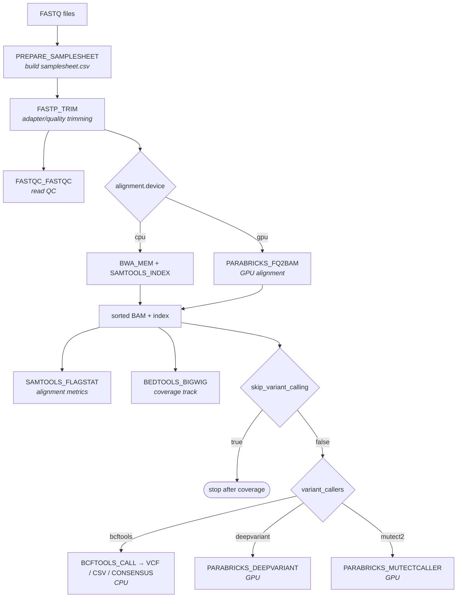
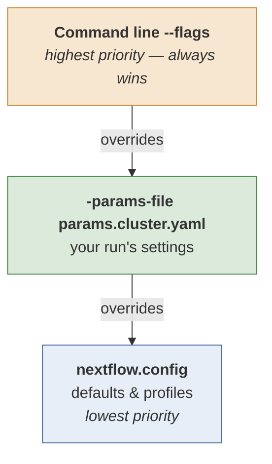

# nf-dnaseq

A Nextflow pipeline for DNA-seq analysis of paired-end short reads: read trimming, QC, alignment, coverage tracks, and variant calling. It runs on a SLURM cluster (or on your own computer with Docker), and supports both **CPU** (bwa + samtools + bcftools) and **GPU** (NVIDIA Parabricks) execution paths.

This README is the **reference**: what the pipeline does, every parameter it
takes, and how the results are laid out.

> **New to the pipeline, or not comfortable on the command line?**
> Start with **[docs/running-the-pipeline.md](docs/running-the-pipeline.md)** —
> a step-by-step tutorial that assumes no Nextflow knowledge. Part 1 runs the
> pipeline on the GBI Sandpit cluster, which is where you should run your
> analyses, including the cluster-specific set-up this README does not cover
> (the Lustre publish workaround, and moving results off Lustre afterwards).
> Part 2 (optional) runs it on your own computer with Docker, for trying it out
> on small data.

> [!IMPORTANT]
> **Lustre (`/mnt/lustre`) is expensive, shared scratch space — do not copy data
> from one Lustre location to another.** If your FASTQ files or reference genome
> are already on Lustre, point `fastq_dir` / `reference_dir` at them where they
> are, or use symlinks (`ln -s`). Link a genome's whole folder rather than the
> `.fasta` alone, so the index files beside it are found. Move results off Lustre
> once a run is finished — see
> [Step 8 of the tutorial](docs/running-the-pipeline.md#step-8--collect-your-results).

---

## What the pipeline does


```mermaid
flowchart TD
    A[FASTQ files] --> B[PREPARE_SAMPLESHEET<br/><i>build samplesheet.csv</i>]
    B --> C[FASTP_TRIM<br/><i>adapter/quality trimming</i>]
    C --> D[FASTQC_FASTQC<br/><i>read QC</i>]
    C --> E{alignment.device}

    E -->|cpu| F[BWA_MEM + SAMTOOLS_INDEX]
    E -->|gpu| G[PARABRICKS_FQ2BAM<br/><i>GPU alignment</i>]

    F --> H[sorted BAM + index]
    G --> H

    H --> I[SAMTOOLS_FLAGSTAT<br/><i>alignment metrics</i>]
    H --> J[BEDTOOLS_BIGWIG<br/><i>coverage track</i>]
    H --> S{skip_variant_calling}
    S -->|true| T([stop after coverage])
    S -->|false| K{variant_callers}

    K -->|bcftools| L[BCFTOOLS_CALL → VCF / CSV / CONSENSUS<br/><i>CPU</i>]
    K -->|deepvariant| M[PARABRICKS_DEEPVARIANT<br/><i>GPU</i>]
    K -->|mutect2| N[PARABRICKS_MUTECTCALLER<br/><i>GPU</i>]
```

**Execution paths at a glance:**

| Stage | CPU option | GPU option |
|---|---|---|
| Alignment | `bwa mem` + `samtools` | Parabricks `fq2bam` |
| Germline calling | `bcftools` | Parabricks `deepvariant` |
| Somatic calling | — | Parabricks `mutectcaller` (`mutect2`) |

> **Note:** `deepvariant` and `mutect2` are **GPU-only** (Parabricks), regardless of `alignment.device`. If you request either of those callers, the run needs GPU nodes even if you aligned on CPU. `bcftools` is CPU-only.

---


## Requirements

- **Nextflow 26.04.4 or newer** (declared in `manifest.nextflowVersion`; the run
  aborts on anything older). To use a specific version without installing it
  system-wide: `NXF_VER=26.04.6 nextflow run ...`
- **On the cluster:** nothing to install. Nextflow is provided as a module
  (`module load nextflow`), and the containers are already set up for the
  `cluster` profile.
- **On your own computer:** Docker, used with `-profile docker`.

If you clone the repo rather than letting Nextflow fetch it, the modules are git
submodules, so clone recursively — a plain clone leaves `modules/` empty and every
`include` fails:

```bash
git clone --recursive https://github.com/EIT-GBI/nf-dnaseq.git
# already cloned?
git submodule update --init --recursive
```

> **Pulling later?** `git pull` moves this repo's *pointer* to each module but
> does not move the module itself, so you can end up running old module code
> against a new pipeline — with no error to tell you. Always follow a pull with:
>
> ```bash
> git submodule update --init --recursive
> ```

### Quick check that everything works

A small end-to-end run on a public test dataset (a ~30 KB SARS-CoV-2 genome and
two tiny FASTQ pairs, fetched over HTTPS - nothing to download by hand):

```bash
nextflow run . -profile test,docker
```

### Example data with a ready-made params file

To try the pipeline the way you would run your own data, use
[`params.example.yaml`](params.example.yaml). It points at the same small
dataset, laid out as a normal FASTQ folder plus a reference genome. The
download commands are in
[docs/running-the-pipeline.md](docs/running-the-pipeline.md#optional--a-practice-run-with-example-data).
Once the data is in place, run:

```bash
nextflow run . -params-file params.example.yaml -profile docker
```

If that works but your own run fails, compare your folder and params file
with the example's.

---

## TLDR: Run it on the cluster

> This is the short version, for people who already use the cluster. The full
> procedure — logging in, checking your set-up, indexing a large reference,
> collecting results — is in
> [docs/running-the-pipeline.md](docs/running-the-pipeline.md#part-1--running-on-the-gbi-cluster).

You do **not** need to clone the repo to run the pipeline. Nextflow can pull it straight from GitHub, so a run is four steps: make a working directory, fetch the params file, edit it, submit.

### 1. Go to the folder where you want your results

Set up a directory where you want your dataset results to go to. Nextflow writes `work/` (large, temporary) and your `outdir` relative to wherever you launch it, so  start in that directory. For example, let's assume your dataset is called `my-illumina-run`:

```bash
# !! Change this to your dataset name !!
DATASET_NAME=my-illumina-run # change this to your dataset name
## Directories for run and work
RUN_DIR=/mnt/lustre/users/$USER/data/$DATASET_NAME
WORK_DIR=/mnt/lustre/users/$USER/nf-work/$DATASET_NAME
## Make sure directories are created and move into the run directory
mkdir -p $RUN_DIR
mkdir -p $WORK_DIR
cd $RUN_DIR
```

Keep only the run's own files here. If your FASTQ files are already elsewhere on Lustre, do not copy them into this folder — set `fastq_dir` to where they are (or a folder of symlinks to them). 

Difference between `RUN_DIR` and `WORK_DIR`:
- `RUN_DIR` is where your params file and results will be stored.
- `WORK_DIR` is where Nextflow keeps intermediate files and temporary data. Once the dataset is fully processed, once can safely delete this directory to free up space. Normally, the two paths are the same, but we separated them to allow people to easily free up space when needed on lustre.

### 2. Fetch the params file

```bash
curl -O https://raw.githubusercontent.com/EIT-GBI/nf-dnaseq/main/params.cluster.yaml
```

### 3. Edit it for your data

```bash
nano params.cluster.yaml     # or vim, or edit it in your interactive session.
```

At minimum set `fastq_dir` (or `samplesheet`), `reference_genome`, and `reference_dir`. If you do not set `outdir`, it will default to a `results` folder inside `RUN_DIR`. See [Key parameters](#key-parameters) for the full list.

### 4. Submit the run

```bash
sbatch -J nf-driver -p cpu \
  --wrap="bash -lc 'module load nextflow && nextflow run https://github.com/EIT-GBI/nf-dnaseq.git -latest \
    -work-dir $WORK_DIR \
    -params-file params.cluster.yaml -profile cluster -resume'"
```

Then watch it with `squeue -u $USER`, and read the driver's log with `tail -f slurm-<jobid>.out`.

There is no need to load Nextflow beforehand: the `module load nextflow` inside `--wrap` loads it in the job itself. If the log says the module cannot be found, check `module avail nextflow` on the login node. If it lists nothing, the module is not available yet, so ask the platform team.

### What each part does

| Part | What it does |
|---|---|
| `sbatch` | Submits the job to SLURM and returns immediately. The job survives you logging out. |
| `-J nf-driver` | Job **name**. This job is only the Nextflow *driver* — it submits and babysits the real work; the actual tools run in their own separate jobs. |
| `-p cpu` | **Partition** (queue) for the driver. The driver itself is tiny, so `cpu` is right even for GPU pipelines — the Parabricks steps request the `gpu` partition themselves. |
| `--wrap="..."` | Runs this command instead of you writing a `#SBATCH` script file. Everything inside the quotes is what actually executes on the node. |
| `bash -lc '...'` | Starts a login shell inside the job so that the `module` command exists. Without it the job fails with `module: not found`. |
| `module load nextflow` | Puts Nextflow on the job's path. Loading it on the login node does not carry over into the job, so it has to be in the command. |
| `nextflow run <url>` | Pulls the pipeline from GitHub and runs it. No clone needed — Nextflow caches it under `~/.nextflow/assets/`. |
| `-latest` | Re-pull the newest commit on the default branch. Without this, Nextflow silently reuses whatever it cached the first time, so you'd miss bug fixes. |
| `-params-file params.cluster.yaml` | Your inputs and settings (this is the file you edited in step 3). |
| `-profile cluster` | Runs each step as its own SLURM job, using the cluster's containers. |
| `-resume` | Reuse cached results from previous runs. Always safe to include. |
| `-work-dir $WORK_DIR` | Specifies the working directory for Nextflow intermediate files. |

> The driver job runs for as long as the whole pipeline takes, so it needs a generous walltime. Add `-t 5-00:00:00` (5 days) if your partition's default limit is shorter than your run.

### Why `sbatch` and not just running it in the terminal

The cluster is still under active development, and `tmux` sessions have been getting killed unpredictably. If the Nextflow driver dies mid-run, the jobs it already submitted are orphaned and you have to clean up and `-resume`. Handing the driver to SLURM avoids that entirely.

### Alternative: run it in a tmux session

If your run is small, you want to watch the progress bars live, and you don't mind the risk of being disconnected, run it interactively instead:

```bash
tmux new -s nf              # start a named session
module load nextflow
nextflow run https://github.com/EIT-GBI/nf-dnaseq.git -latest \
  -params-file params.cluster.yaml -profile cluster -resume
```

Detach with `Ctrl-b` then `d`, and come back later with `tmux attach -t nf`. If the session does get killed, just re-run the same command with `-resume` — completed tasks are cached.

---

## Preparing your inputs

You give the pipeline reads in one of **two ways**:

### Option A — point it at a FASTQ directory (easiest)

Set `fastq_dir` and `reference_genome`; the pipeline builds the samplesheet for you. FASTQ files must be paired and named:

```
<sample>_R1[_001].fastq.gz
<sample>_R2[_001].fastq.gz
```

(Accepted suffixes: `.fastq.gz`, `.fq.gz`, `.fastq`, `.fq`. The trailing `_001` is optional.)

### Option B — provide your own samplesheet

Set `samplesheet` to a CSV with these columns:

```csv
sample,R1,R2,reference
SAMPLE_A,/abs/path/A_R1.fastq.gz,/abs/path/A_R2.fastq.gz,mouse/genome.fasta
```

`reference` is a path **relative to `reference_dir`** (see below).

An optional `platform` column sets the sequencing platform recorded as `PL` in
each BAM's read group, so one run can mix platforms:

```csv
sample,R1,R2,reference,platform
SAMPLE_A,/abs/path/A_R1.fastq.gz,/abs/path/A_R2.fastq.gz,mouse/genome.fasta,OXFORD_NANOPORE
SAMPLE_B,/abs/path/B_R1.fastq.gz,/abs/path/B_R2.fastq.gz,mouse/genome.fasta,
```

Where a row leaves it blank, or the column is absent, `--platform` applies; with
neither set the aligners record `ILLUMINA`. This works the same on the CPU and
GPU paths.

### Reference genome layout

References live under `reference_dir`, and `reference_genome` is the path **relative** to it. For example, with:

```yaml
reference_dir: "/mnt/gbi-shared/.../references/"
reference_genome: "mouse/MDS42_r24-30_27B_SC.fasta"
```

the pipeline resolves `/mnt/gbi-shared/.../references/mouse/MDS42_r24-30_27B_SC.fasta`.

A bare `.fasta` is enough: the pipeline checks for each index beside the
reference and builds whatever is missing before alignment. These are the files
it needs, and builds if absent:

| File(s) | Built by | Needed for |
|---|---|---|
| `*.fasta.fai` | `SAMTOOLS_FAIDX` | variant calling, bigwig |
| `*.fasta.{amb,ann,bwt,pac,sa}` | `BWA_INDEX` | bwa index (used by **both** CPU and GPU alignment) |

**Pre-indexing is still worth it for large genomes**, for two reasons:

- The index is built per *run directory*, so a fresh run folder rebuilds it.
  For a mouse or human reference that is an hour or more each time.
- The GPU path needs it beside the real reference. Parabricks resolves `--ref`
  to its real path and expects the whole index, `.fai` included, next to it.

Build both indexes once on a compute node with the bundled script:

```bash
sbatch scripts/index_reference.sbatch /path/to/genome.fasta
```

It skips any index that already exists. Login nodes have no container runtime,
and `bwa index` needs roughly 5.5x the genome size in RAM, so it must run as a
job rather than on the login node - raise `--mem` for a large reference.

---

## Key parameters

These live in `params.cluster.yaml`:

| Parameter | Meaning |
|---|---|
| `samplesheet` | Path to a samplesheet CSV, or `null` to build one from `fastq_dir` |
| `fastq_dir` | Directory of paired FASTQs (used when `samplesheet: null`) |
| `reference_genome` | Reference FASTA, **relative to** `reference_dir` |
| `reference_dir` | Root directory holding reference genomes + indexes |
| `outdir` | Where published results go |
| `alignment.device` | `cpu` (bwa/samtools) or `gpu` (Parabricks fq2bam) |
| `trimmer` | `fastp` (`cutadapt` not yet implemented) |
| `platform` | Sequencing platform recorded as `PL` in the BAM read group, for samples whose samplesheet row does not set one. Unset records `ILLUMINA` |
| `skip_variant_calling` | `true` to skip variant calling entirely: no output from any caller, and no consensus; `false` (default) to run it |
| `variant_callers` | List: any of `bcftools`, `deepvariant`, `mutect2`. Ignored when `skip_variant_calling` is `true` |
| `min_mapq`, `min_qual`, `min_depth`, `ploidy` | bcftools calling/filtering thresholds |
| `ucsc_dir` | Only for **local** runs (path to `bedGraphToBigWig`); ignored on the cluster |

Example `variant_callers` block (YAML list — comment/uncomment to choose):

```yaml
variant_callers:
  - bcftools
  - deepvariant
#  - mutect2
```

> **Mind the two different defaults.** The block above is what
> `params.cluster.yaml` ships with, so a run using that file unedited requests
> **`deepvariant`, which is GPU-only** - it will queue for GPU nodes even if you
> aligned on CPU. The pipeline's own default in `nextflow.config` is
> `['bcftools']` alone, which is what you get with no params file. Drop the
> `deepvariant` line unless you want the GPU path.

To skip variant calling altogether, leave `variant_callers` as it is and set:

```yaml
skip_variant_calling: true
```

The run then stops after coverage: trimming, FastQC, alignment, flagstat and
bigwig still happen, and `variants/` and `consensus/` are simply not produced.
The consensus goes with the callers because it is built from the bcftools calls.

---


## Overriding parameters

A parameter can be set in three places. They form **layers**, and higher layers win:


```mermaid
flowchart TD
    C["<b>Command line --flags</b><br/><i>highest priority — always wins</i>"]
    B["<b>-params-file params.cluster.yaml</b><br/>your run's settings"]
    A["<b>nextflow.config</b><br/>defaults & profiles<br/><i>lowest priority</i>"]

    C -->|overrides| B
    B -->|overrides| A

    style C fill:#f7e6d0,stroke:#c98a3a
    style B fill:#dbeadb,stroke:#4a8a4a
    style A fill:#e8eef7,stroke:#4a6fa5
```

> **config  <  params-file  <  command line**

So you can keep a stable `params.cluster.yaml` and tweak individual runs on the command line without editing files.

> The examples below are written as `nextflow run main.nf` for brevity, i.e. from a clone. If you are running from GitHub, swap that for `nextflow run https://github.com/EIT-GBI/nf-dnaseq.git -latest`, and wrap the whole thing in `sbatch --wrap="bash -lc 'module load nextflow && ...'"` as above.

### Examples

Switch to the GPU alignment path for one run:

```bash
nextflow run main.nf -params-file params.cluster.yaml -profile cluster \
  --alignment.device gpu -resume
```

Change calling thresholds on the fly:

```bash
nextflow run main.nf -params-file params.cluster.yaml -profile cluster \
  --min_depth 20 --min_qual 30 -resume
```

Choose variant callers from the command line (comma-separated, **no spaces**):

```bash
nextflow run main.nf -params-file params.cluster.yaml -profile cluster \
  --variant_callers bcftools,deepvariant,mutect2 -resume
```

Skip variant calling for one run, without editing the params file:

```bash
nextflow run main.nf -params-file params.cluster.yaml -profile cluster \
  --skip_variant_calling true -resume
```

**Gotchas:**
- Nested params use dotted notation: `--alignment.device gpu` (not `--device`, which is unused).
- List params (`variant_callers`) must be a **comma-separated string** on the CLI — the pipeline splits it. You **cannot** repeat `--variant_callers` to add items; the last one wins.
- Scalars (numbers, strings, `cpu`/`gpu`) work directly on the CLI.
- Boolean params need an explicit value: `--skip_variant_calling true`, not a bare `--skip_variant_calling`.

---

## Outputs

Results are published under `outdir`:

```
outdir/
├── samplesheet/          # the samplesheet used for the run, generated or supplied
├── trimmed/              # fastp reports (html/json) - not the trimmed FASTQs
├── qc/
│   ├── fastqc/           # FastQC reports
│   └── flagstat/         # samtools flagstat metrics
├── alignment/            # sorted BAM + index (+ duplicate metrics on the GPU path)
├── bigwig/               # coverage tracks (.bw)
├── consensus/            # consensus FASTA
└── variants/
    ├── bcftools/
    │   └── bcf/  vcf/  csv/   # bcftools outputs
    ├── deepvariant/
    │   └── vcf/               # DeepVariant VCFs (GPU)
    └── mutect/
        └── vcf/               # Mutect2 VCFs (GPU)
```

Publishing is defined by the `output {}` block at the bottom of `main.nf`, not by
`publishDir` directives inside the modules. That means the modules stay reusable
across pipelines, and the whole results tree can be relocated from the command
line without touching any config:

```bash
nextflow run . -profile cluster -params-file params.cluster.yaml -output-dir /path/to/results
```

`--outdir` still works and remains the documented knob; `-output-dir` (or `-o`)
overrides it.

---

## GPU notes

The `cluster` profile requests GPUs for all Parabricks steps:

```groovy
withName: 'PARABRICKS_.*' {
    memory           = 32.GB
    accelerator      = 2
    clusterOptions   = '--gres=gpu:2'   // typed gres (nodes expose gpu:h100:8); keep count == accelerator/--num-gpus
    queue            = 'gpu'
    containerOptions = '--nv'           // exposes host GPUs to the container
}
```

Keep the **GPU count consistent** across `--gres`, `accelerator`, and the tool's `--num-gpus` (the modules derive `--num-gpus` from `accelerator` automatically). #todo make them match automatically if the user sets `--num-gpus` on the CLI.

---

## Troubleshooting

| Symptom | Likely cause / fix |
|---|---|
| `Invalid include source: .../modules/...` | Submodules not checked out → `git submodule update --init --recursive` |
| A module behaves like an older version after `git pull` | The submodule pointer moved but the module did not → `git submodule update --init --recursive` |
| `module: not found` in the driver log | The `bash -lc '...'` wrapper was dropped from the `sbatch --wrap` command → submit it exactly as in [step 4](#4-submit-the-run) |
| `nextflow: command not found` | Nextflow is not loaded → `module load nextflow` (inside the `--wrap` command when using `sbatch`) |


## TODO list
- [ ] Add `cutadapt` trimmer option.
- [ ] Add 'gatk' variant caller option.
- [ ] Add produce csvs for all variant callers. Easy for inspection.

